# AI Research Library

A Python-based AI research paper management system built using Object-Oriented Programming and functional-style programming concepts.

The project loads research papers from the arXiv API, stores them in JSON format, and provides search, filtering, sorting, and statistics features.

---

## Features

- Load research papers from a JSON dataset
- Search papers by title
- Search papers by category
- Search papers by tag
- Sort papers by title
- Sort papers by publication year
- Filter recent papers
- Display project statistics
- Generator-based iteration
- Functional-style programming using map(), filter(), lambda, and sorted()

---

## Technologies

- Python 3
- Object-Oriented Programming
- Dataclasses
- JSON
- Functional Programming
- arXiv API

---

## Project Structure

```
ai_knowledge_base/
│
├── data/
│   └── documents.json
│
├── loaders/
│   └── json_loader.py
│
├── managers/
│   └── knowledge_base_manager.py
│
├── models/
│   └── document.py
│
├── scripts/
│   └── build_dataset.py
│
├── main.py
├── README.md
├── requirements.txt
└── .gitignore
```

---

## System Architecture & Workflow



---

## Dataset

The dataset was generated automatically using the arXiv API.

The script `build_dataset.py` retrieves AI-related research papers and stores them as `documents.json`.

Topics include:

- Large Language Models
- Transformers
- Computer Vision
- Reinforcement Learning
- Diffusion Models
- Retrieval-Augmented Generation
- Multimodal AI

---

## How to Run

Clone the repository:

```bash
git clone <repository-url>
```

Install dependencies:

```bash
pip install -r requirements.txt
```

Run the project:

```bash
python main.py
```

---

## Learning Objectives

This project demonstrates practical usage of:

- Classes and Objects
- Dataclasses
- Type Hints
- JSON File Handling
- Object-Oriented Design
- map()
- filter()
- lambda
- sorted()
- Generators
- Modular Project Structure

---

## Future Improvements

- PDF Downloader
- Keyword Search
- Command Line Interface (CLI)
- SQLite Database Support

## Author

Nesa Karimi
